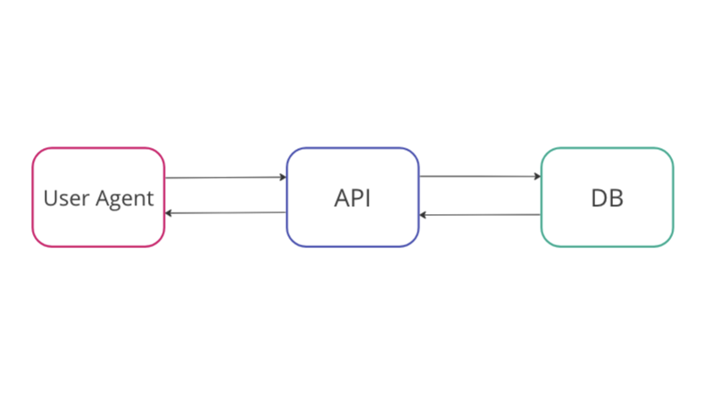
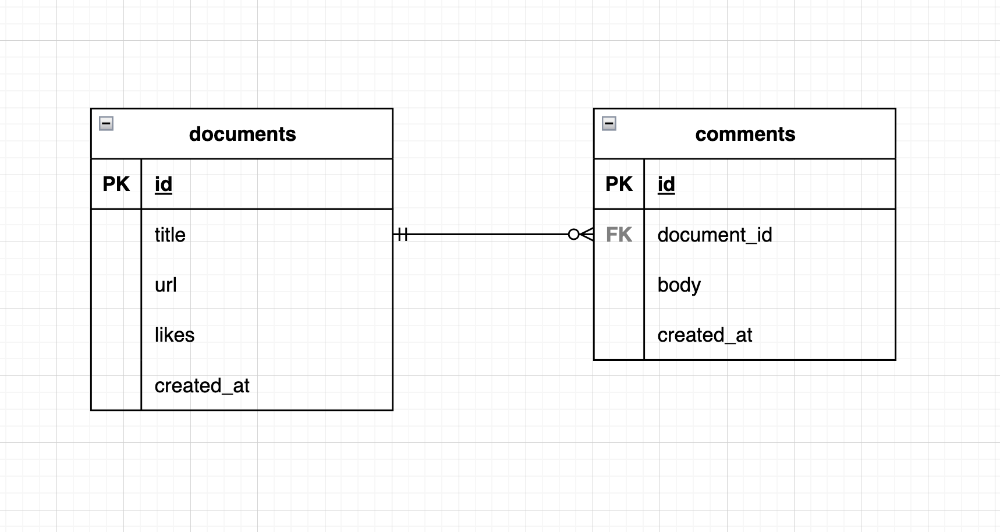

# 0 ~ サービス設計編 ~

APIの入門書

## そもそもAPIとは

hoge

<br>

## 今回作るAPIについて

### 背景

あなたは同志社のエンジニアサークル「Do'er」に所属する大学３年生です。
バックエンドエンジニアを目指して日々勉強しています。

ある日、今**話題でイケイケのGo言語**を勉強しようと思い、サークルのチャットで
「Goの良さげな記事とかサイト知ってる方いたら教えてください」と聞きました。

ですが反応はいまいち、返信は2,3件しかきませんでした。

普段はDo'erは活発なので100件くらい返信が来ますが、今はテスト期間と重なり、アクティブなユーザーが少ないようです。

「サークルの人がお勧めしている記事やwebサイトがまとめてある場所があればなあ」

課題を感じたあなたは課題を解決するべく、サービスの開発を始めることにしました。

ただしあなたはバックエンドが大好きなので、今回はAPIのみ開発します。

<br>

### 課題
あらためて課題を振り返ってみましょう。

解決したい課題
```
サークルのメンバーがおすすめしている記事やwebサイトがまとめてある場所が欲しい
```

ただ、まとめてあると言っても、ランキングがあったり検索機能があったりするといいですよね。

どんな機能をつけるか、次の「ユースケース分析」で考えてみましょう。

<br>

### ユースケース分析

ユースケース（英:use case）とは、システムを使う人の目線で「このシステムは、こんなことができるのね」を表現してみることで、どんなシステムになるかのイメージをつかむやり方です。 ([引用](https://wa3.i-3-i.info/word16097.html))

ではどんなユースケースが考えられるでしょうか。

例えば、ただ記事やwebサイトがまとめてあるだけではなく、"いいね"の概念があり、
いいね順にソートしてみることができると、より良い記事を見つけやすくなりますね。
またコメント機能があると、事前に内容について知ることができるかもしれないですね。

他にもサービスのユースケースを考えてみましょう。

また以降では記事やwebサイトをまとめて"ドキュメント"と呼びます。

<br>

```
# ユースケース

- ドキュメントを投稿する
- ドキュメントの一覧を見る
- ドキュメントにいいねをつける
- ドキュメントにコメントをつける
- ドキュメントのコメントをみる
```

最低限必要なユースケースをあげてみました。
本来は記事の更新や削除、コメントも更新や削除、他にも記事の投稿者がみたいなどのユースケースもあるかもしれませんが一旦今回は省きます。

ちなみに今回のような、顧客に価値を提供できる最小限のプロダクトのことをMVP（Minimum Viable Product）といいます。([引用](https://www.sansokan.jp/akinai/faq/detail.san?H_FAQ_CL=0&H_FAQ_NO=1468#:~:text=MVP%EF%BC%88Minimum%20Viable%20Product%EF%BC%89%E3%81%A8%E3%81%AF%E3%80%81%E9%A1%A7%E5%AE%A2%E3%81%AB%E4%BE%A1%E5%80%A4,%E3%81%AE%E8%A6%8B%E7%9B%B4%E3%81%97%E3%82%92%E5%9B%B3%E3%82%8A%E3%81%BE%E3%81%99%E3%80%82))

<br>

### ユースケース分析(深堀編)

上記のユースケースについて深掘りしましょう。
TODO:

では、あらためてユースケースについて深掘りしつつ分析しましょう。

```
ユースケース

- ドキュメントを投稿する
  - ドキュメントの情報を受け取り、受け取ったデータの確認をする
    - 例えばドキュメントのタイトルが設定されているかどうかなど
  - 問題がなければDBに保存する
- ドキュメントの一覧を見る
  - ドキュメントの一覧をDBから取得する
  - いいね順にソート(並び替え)したい
  - 検索機能も欲しい
- ドキュメントにいいねをつける
  - 指定されたIDのドキュメントをDBから取得する
  - ドキュメントのいいねの数値を増やす
  - 更新したドキュメントを返す
- ドキュメントにコメントをつける
  - コメントの情報を受け取り、受け取ったデータの確認をする
    - 例えばからのコメントじゃないかどうかなど
  - コメントを紐づけるドキュメントがそもそも存在するか確認する
  - 問題なければDBに保存する
- ドキュメントのコメントをみる
  - 指定されたIDのドキュメントに紐づくコメントの一覧を取得する
```

こんな感じでしょうか。


TODO:

それではユースケース分析が終わったので次は設計をしていきましょう。


## 設計

設計は大きく分けて3つ行います。
全体の構成図の設計、DB設計、そしてAPI設計です。

### 全体の構成図

全体の構成図はいたってシンプルです。

UserAgent(利用者のブラウザ)からAPIにアクセスがあり、APIがDBからデータを取得したり保存したりします。

矢印の向きの通りで、UserAgentからDBを直接触ることはありません。



<br>


### DB設計

DBの設計もシンプルです。

Documentsテーブル(記事やwebサイト)とそれに紐づくCommentsテーブルの2つです。



これは余談ですが、大きめのサービスだと100(TODO:)個くらいテーブルがあることもあります。

<br>

テーブルのカラムについて詳細を書いておきます。

```
- documents
  - id:         データを一意に識別するキー
  - title:      ドキュメントのタイトル
  - url:        ドキュメントのリンク
  - likes:      いいね数
  - created_at: データが登録された日時
- comments
  - id:          データを一意に識別するキー
  - document_id: どのドキュメントと結びついてるかを示す外部キー
  - body:        コメントの内容 
  - created_at:  データが登録された日時
```

<br>

### API設計

お待たせしました。最後にAPI設計です。

以下に必要なAPIをまとめます。


```
- ドキュメントを投稿する
  - POST /v1/documents
  - request body
    - title: 必須
    - url:   必須
  - response
    - success
      - status: 201
    - error
      - status: 400
      - response body
        - error type
        - error message
- ドキュメントの一覧を見る
  - GET /v1/documents/list
- ドキュメントにいいねをつける
  - POST /v1/documents/{id}/likes
- ドキュメントにコメントをつける
  - POST /v1/documents/{id}/comments
- ドキュメントのコメントをみる
  - GET /v1/documents/{id}/comments/list
```

少し書き方が雑ですが、こんなところでしょうか。

<br>

## この章の振り返り

この章では、最初に課題の紹介、その後ユースケース分析、

さらにその深掘りやユースケースを実装するために必要な設計などを行いました。

次の章では実際に開発を行います。

と言いたいところですが、先に環境構築をしましょう。

